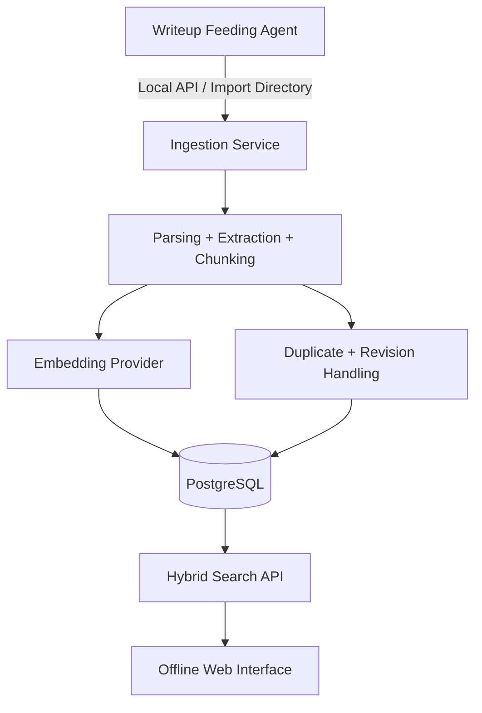
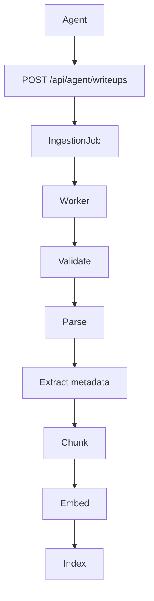
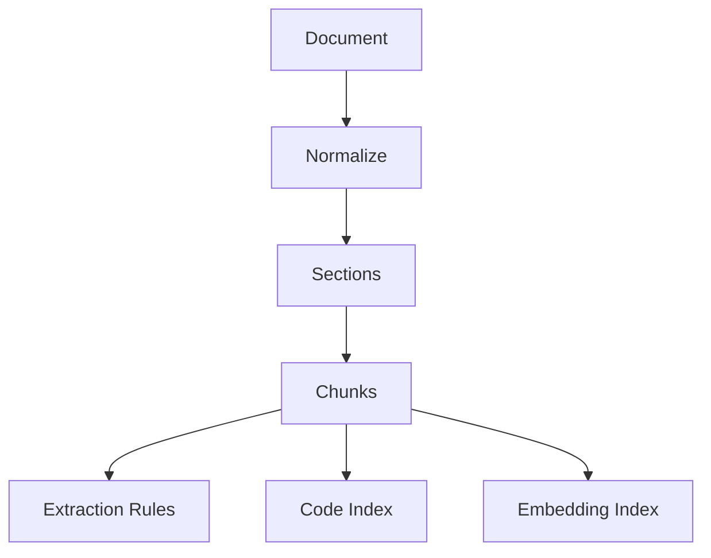
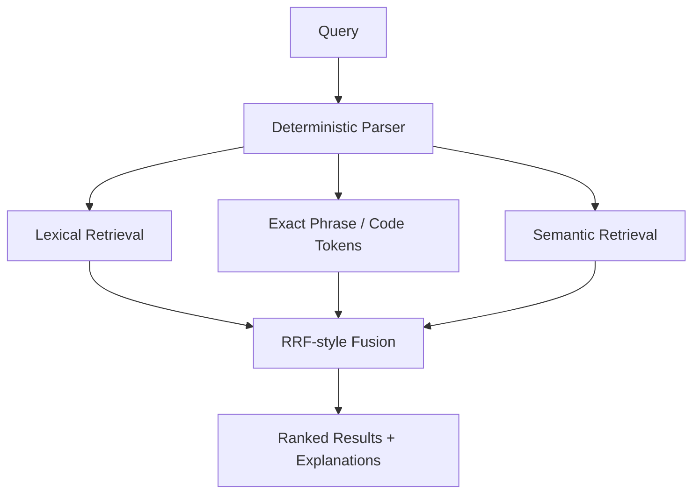

# CTF Search

Offline search engine for CTF writeups. The system accepts locally supplied writeups, parses and normalizes them, extracts CTF metadata, chunks prose and code, generates local embeddings, indexes results in local storage, and serves a search and admin UI without internet access at runtime.

## Architecture









## Offline deployment

1. Copy `.env.example` to `.env`.
2. Place a local embedding model under `/models/embedding-model` or switch `EMBEDDING_PROVIDER=fake` for tests.
3. Run `docker compose up --build`.

The application does not call remote APIs. Runtime model downloads are disabled; `SentenceTransformer` loads with `local_files_only=True`.

## Local model requirements

- `EMBEDDING_MODEL_PATH` must point to a readable local model directory.
- `EMBEDDING_PROVIDER=sentence_transformers` verifies the directory at startup and readiness checks.
- `EMBEDDING_PROVIDER=onnx` verifies the configured ONNX path.
- `EMBEDDING_PROVIDER=fake` is deterministic and intended for tests.

## Database and startup

- Backend: FastAPI
- Frontend: Next.js
- Storage: PostgreSQL in Docker Compose
- Queue: Redis with RQ-compatible worker entrypoints

Run migrations:

```bash
make migrate
```

Create an agent token:

```bash
make create-agent-token NAME=writeup-agent
```

## Feeding agent contract

Agent endpoint:

```http
POST /api/agent/writeups
Authorization: Bearer <token>
Idempotency-Key: <opaque-key>
Content-Type: application/json
```

Payload shape:

```json
{
  "external_id": "agent-source-000123",
  "title": "Babyheap Writeup",
  "event": "ExampleCTF",
  "event_year": 2026,
  "challenge": "babyheap",
  "category": "pwn",
  "difficulty": "hard",
  "authors": ["alice"],
  "team": "ExampleTeam",
  "language": "en",
  "published_at": "2026-04-12T10:00:00Z",
  "source_reference": "local-agent-source",
  "original_source_url": null,
  "content_format": "markdown",
  "content": "# Babyheap\n\n...",
  "metadata": {
    "architecture": ["amd64"],
    "protections": ["PIE", "NX", "Full RELRO"]
  },
  "attachments": [
    {
      "attachment_id": "solve-script",
      "filename": "solve.py",
      "relative_path": "attachments/solve.py",
      "sha256": "..."
    }
  ]
}
```

Additional endpoints:

- `POST /api/agent/writeups/batch`
- `POST /api/agent/writeups/{external_id}/attachments`
- `GET /api/agent/jobs/{job_id}`
- `GET /api/agent/writeups/{external_id}/status`
- `POST /api/agent/writeups/{external_id}/reindex`
- `DELETE /api/agent/writeups/{external_id}`

Idempotency is enforced by `external_id` plus payload hash. A resubmission with changed content creates a new revision.

## Import package format

```
writeup-package/
├── manifest.json
├── content.md
└── attachments/
    └── solve.py
```

The validator rejects absolute paths, path traversal, and symlinks. ZIP support is wired through the package validator and must stay within strict extraction limits.

## Watched import workflow

The watcher scans:

```text
imports/
├── pending/
├── processing/
├── completed/
├── rejected/
└── attachments/
```

Packages move atomically from `pending` to `processing`. Success moves them to `completed`. Failures move them to `rejected` with a sibling `.error.json`.

## Commands

```bash
make setup
make dev
make test
make lint
make migrate
make seed
make import-samples
make create-agent-token NAME=writeup-agent
make reindex
make evaluate
make export
make offline-test
```

CLI entrypoints:

```bash
python3 cli/main.py import-package ./sample-data/packages/flask-session-forgery
python3 cli/main.py import-package ./sample-data/packages/pickle-deserialization-source
python3 cli/main.py import-jsonl ./sample-data/writeups.jsonl
python3 cli/main.py watch-imports
python3 cli/main.py create-agent-token --name writeup-agent
```

## Security notes

- Imported content is treated as untrusted.
- The system never executes imported scripts or archives.
- HTML parsing strips active content.
- Attachment storage uses generated filenames in configured local directories.
- Token storage is hashed.

## Backup and restore

- `python3 cli/main.py export ./backup`
- `python3 cli/main.py restore ./backup`

## Troubleshooting

- Startup failures on `/ready` usually mean the database, attachment directory, import directory, or local embedding model is unavailable.
- Failed watcher imports write JSON error reports beside rejected packages.
- If you do not have a local embedding model yet, set `EMBEDDING_PROVIDER=fake` for non-production testing.

## Production recommendations

- Run the parser and ingestion worker in a separate container with reduced privileges.
- Mount models read-only.
- Keep admin and agent tokens distinct.
- Replace the deterministic fake embedding provider with a vetted local model before production.
